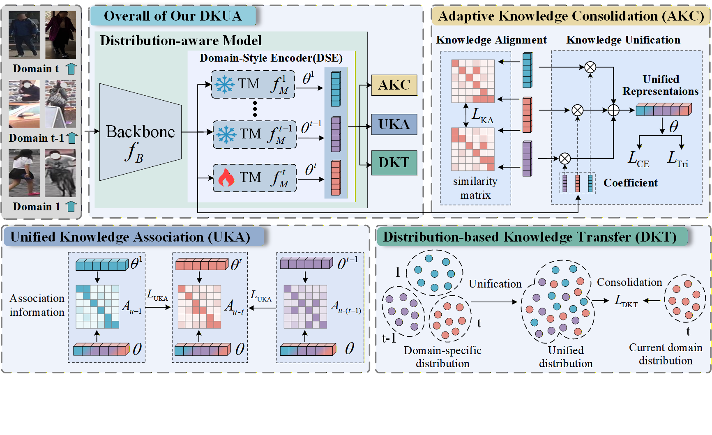

## Distribution-aware Knowledge Unification and Association for Non-exemplar Lifelong Person Re-identification [[Paper]]()

```
Our work proposes a novel distribution-aware knowledge unification and association (DKUA) framework where domain-style modeling is performed for each instance to propagate domain-specific representations, enhancing anti-forgetting and generalization capacity.
```


## Getting Started
### Requirements
- Python 3.7
- torch 1.10.0
- For more detailed requirements, run
```
pip install -r requirements.txt
```
### Dataset preparation
- Please follow [Torchreid_Datasets_Doc](https://kaiyangzhou.github.io/deep-person-reid/datasets.html) to download datasets and unzip them to your data path .
- Prepare the Seen dataset structure as follow:   ./docs/seen dataset structure .md
- Prepare the Unseen dataset structure as follow:  ./docs/Unseen dataset structure .md
### Training

Training order-1 for training.

```
python lifelong_train.py --data-dir=/your seen dataset path  --logs-dir==/save path --orders="order-1"
```

Training order-2 for training.

```
python lifelong_train.py --data-dir=/your seen dataset path  --logs-dir==/save path --orders="order-2"
```

